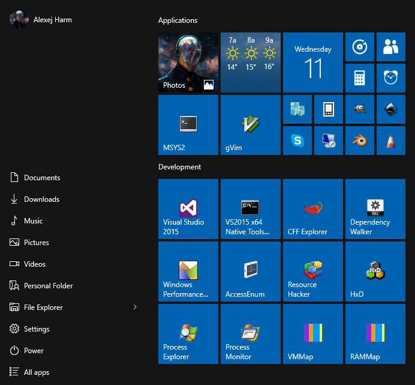

# Software
This document describes the installation and configuration of software useful for developers.



- [7-Zip][7-zip]
- [Chrome][chrome]
- [Firefox][firefox]
- [Office 2013][office]
- [SQL Server 2014][sql2014]
- [Visual Studio 2015][vs2015]
- [Visual Studio Line Endings Unifier][vsleu]
- [VMWare vSphere][vsphere55]
- [CMake][cmake]
- [Nasm Assembler][nasm]
- [Python][python]
- [gVim][vim]
- [HxD][hxd]
- [Git][git]
- [CFF Explorer][cff]
- [Resource Hacker][rhack]
- [Sysinternals Suite][sysinternals]
- [Dependency Walker][depwalk]
- [Wireshark][wireshark]
- [KeePass 2][keepass]
- [MPV][mpv]
- [Gimp][gimp]
- [Inkscape][inkscape]
- [Blender][blender]
- [Sketchbook Pro][sketchbook]
- [IcoFx][icofx]
- [OBS Studio][obs]
- [MSYS2][msys2]
- [ImageUSB][imageusb]

[7-zip]: http://www.7-zip.org
[chrome]: https://www.google.com/chrome
[firefox]: https://www.mozilla.org/firefox
[office]: https://www.office.com/backup
[sql2014]: https://msdn.microsoft.com/en-us/subscriptions/downloads/#FileId=63715
[vs2015]: https://www.visualstudio.com/en-us/products/visual-studio-community-vs.aspx
[vsleu]: https://visualstudiogallery.msdn.microsoft.com/b2bbadd2-c337-43d7-9343-752ebbdd900f
[vsphere55]: https://my.vmware.com/web/vmware/info/slug/datacenter_cloud_infrastructure/vmware_vsphere/5_5
[cmake]: http://www.cmake.org
[nasm]: http://www.nasm.us
[python]: https://www.python.org
[vim]: http://www.vim.org
[hxd]: http://mh-nexus.de/en/hxd
[git]: https://git-scm.com
[cff]: http://www.ntcore.com/exsuite.php
[rhack]: http://www.angusj.com/resourcehacker
[sysinternals]: https://technet.microsoft.com/en-us/sysinternals/bb842062.aspx
[depwalk]: http://www.dependencywalker.com
[wireshark]: https://www.wireshark.org
[keepass]: http://keepass.info
[mpv]: https://mpv.io
[gimp]: http://www.gimp.org
[inkscape]: https://inkscape.org
[blender]: https://www.blender.org
[sketchbook]: http://www.autodesk.com/products/sketchbook-pro
[icofx]: http://icofx.ro
[obs]: https://obsproject.com
[msys2]: https://msys2.github.io
[imageusb]: http://www.osforensics.com/tools/write-usb-images.html


## Fonts
Install optional fonts.

- [DejaVu Font and DejaVu LGC Font][dejavu]
- [DejaVu Sans Mono for Powerline Font][powerline]
- [Iconsolata Font][iconsolata]
- [IPAex Fonts][ipaex]

[dejavu]: http://dejavu-fonts.org/wiki/Download
[powerline]: https://github.com/powerline/fonts
[iconsolata]: http://www.levien.com/type/myfonts/inconsolata.html
[ipaex]: http://ipafont.ipa.go.jp


## Office 2013
Install the english version of Microsoft Office 2013 from <https://www.office.com/backup>.

1. Select "MS office came with a physical installation medium but I need to download it again".
2. Select "United States" and "English".
3. Select "Download" (this option is displayed to the right of the CD key).


## SQL Server
Install *SQL Server 2014*.

```
Installation
+ New SQL Server stand-alone installation...
  + Setup Role
    (•) SQL Server Feature Installation
  + Feature Selection
    [✓] SQL Server Replication
    [✓] Management Tools - Basic
    [ ] Management Tools - Complete
    [✓] SQL Client Connectivity SDK
  + Instance Configuration
    (•) Default instance
  + Database Engine Configuration
    (•) Windows authentication mode
    [Add Current User]
```


## Resource Hacker
Among many other things, *Resource Hacker* application can be used to change the icons of installed executables.


## MSYS2
Install *MSYS2* to `C:\MSYS2`. Follow the instructions on <https://msys2.github.io> to update the software.

Install commonly used packages.

```
pacman -S \
  cloc \
  diffutils \
  git \
  gnu-netcat \
  irssi \
  lftp \
  make \
  openssh \
  p7zip \
  perl \
  python2 \
  subversion \
  tar \
  tftp-hpa \
  tree \
  vim \
  wget \
  zsh
```

Install optional packages.

```
pacman -S \
  mingw-w64-x86_64-imagemagick \
  mingw-w64-x86_64-pngcrush
```
